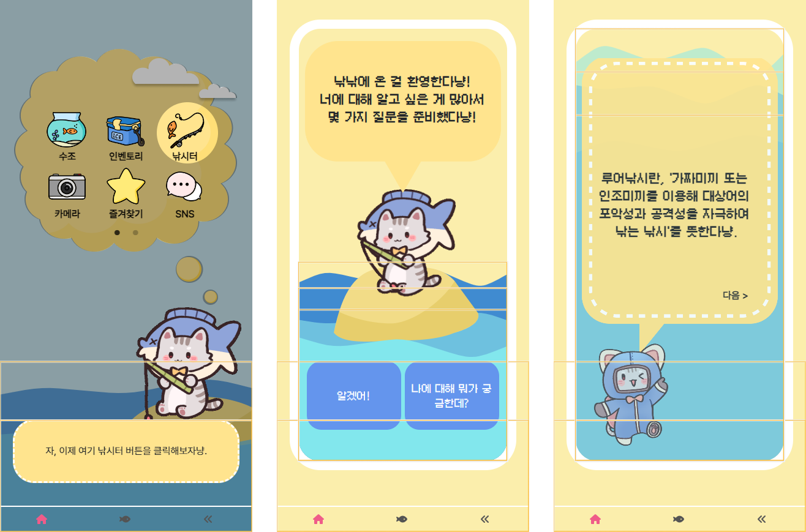
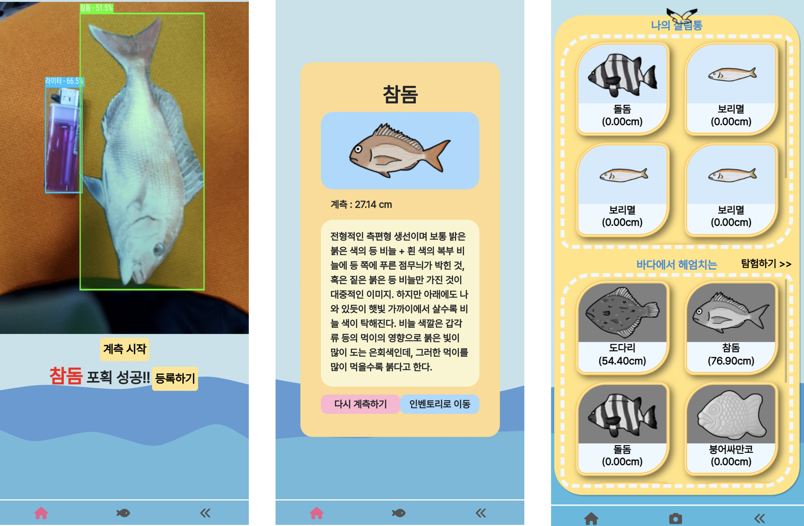
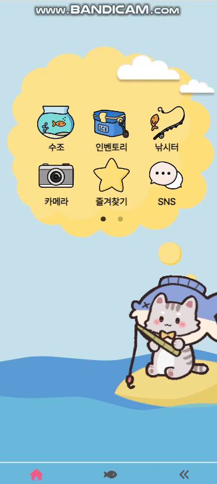
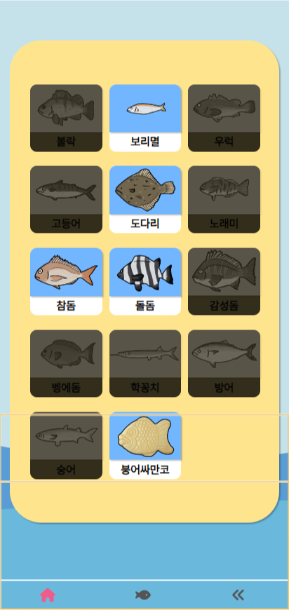
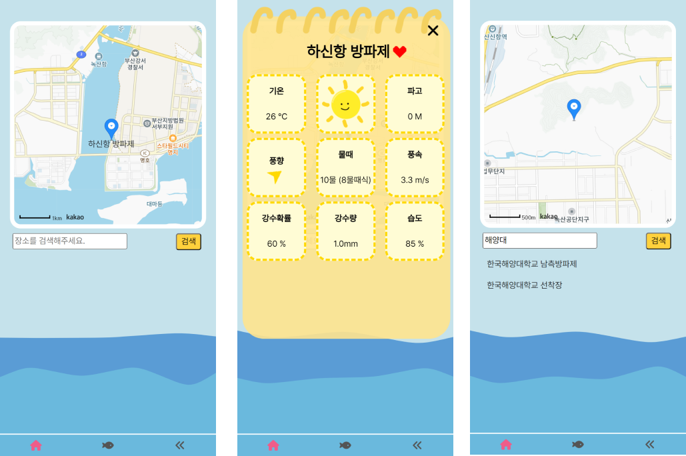
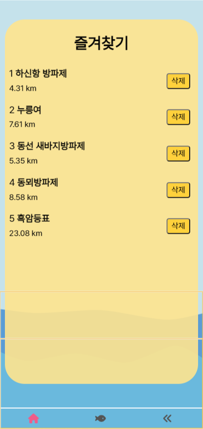
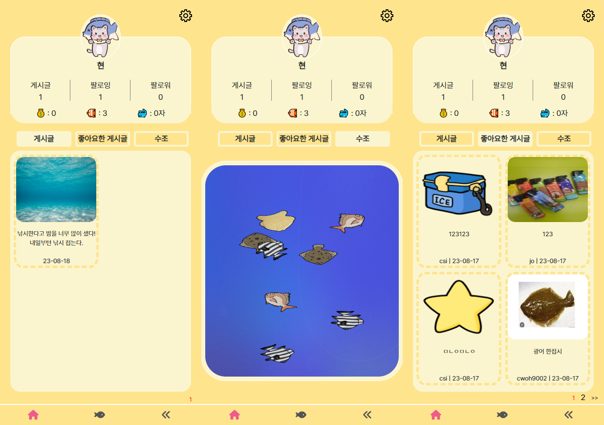
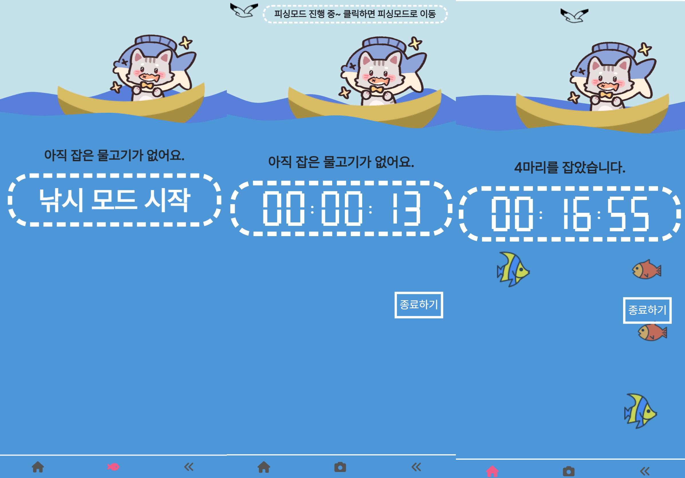

<h1 align="center"> E105 공통프로젝트 </h1>

## 📝 목차

[프로젝트 개요](#item-one)

[역할 분담](#item-two)

[기술 스택](#item-three)

[데이터 베이스 모델링 (ERD)](#item-four)

[서비스 구현 화면](#item-five)

[느낀 점](#item-end)

## 프로젝트 개요

---

 **낚시 초보들을 위한 A to Z 어플리케이션** 

<aside>
💡 저희 팀은 초보자를 위한 낚시 어플 서비스 “낚낚” 을 만들었습니다.

낚시가 처음인 사람을 위해 어플 사용법과 낚시의 기본을 알려주는 뉴비 가이드!

**찰칵!** 낚시를 성공했을때 어플로 촬영하면 잡은 어종의 종류와 크기를 알려주는 AI 서비스!

내가 잡은 물고기를 등록하는 도감 서비스와 잡은 물고기를 구경할 수 있는 수족관 서비스 등을 만들었습니다.

저희 서비스와 함께 낚시를 시작해보세요!

</aside>

# 프로젝트 확인하기

모바일 웹으로 접속 : [https://i9e105.p.ssafy.io](https://i9e105.p.ssafy.io/)

웹 apk 설치 경로 : https://i9e105.p.ssafy.io/api1/upload/app-arm64-v8a-release.apk

## 역할 분담

**Frontend**

- 최상익 : UX/UI 설계, 카메라(욜로) 설정 및 수조 상호작용 구현, 플러터 기능 구현, 프로필페이지 제작, 사전 및 TMI 페이지 제작
- 윤자현 : UX/UI 설계, 뉴비페이지 컨텐츠 제작 및 TTS연결, 기상청 api 카카오맵 활용해 낚시 지도 생성 및 정보 전달 페이지 제작, 피싱모드 제작
- 조병철 : UX/UI 설계, 사용자 SNS(커뮤니티) 페이지, 물고기 도감 페이지, 일러스트제작, PPT 제작 및 발표

**Backend**

- 이강민 : 스크럼 마스터, 백엔드 주요 기능 API 개발, 개발 서버 CI, AI 데이터 학습, 영상 제작, 서비스 아키텍쳐 설계
- 조현덕 : sns 기능에 사용되는 DB와 api 서비스 제작, Mahout 라이브러리를 사용해 유저별 게시글 추천, 학습에 사용되는 이미지 데이터 정제
- 오철원 : DevOps CI/CD, 배포 관리, 서버 데이터 보안, 시스템 환경& 서비스 기능 QA, 테크니컬 라이터

 

## 기술 스택

## **⚙** Management Tool

- 형상 관리 : Gitlab
- 이슈 관리 : Jira
- 커뮤니케이션 : Mattermost, Webex, Notion, Discord
- 디자인 : Figma, PowerPoint

## 💻 IDE

- Visual Studio Code `1.75.1`
- IntelliJ `IntelliJ IDEA 2022.3(Ultimate Edition)`

## 📱 Frontend

- React `18.2.0`
- Javacript `4.9.3`
- Flutter

## 💾 Backend

- Springboot  `3.1.1`
- Spring Data JPA
- Spring Data Redis(lettuce)
- Redis
- MySql 8.0.33
- Mongodb
- Apache Kafka 3.5.0
- SSL
- CertBot(CA Certificates)`

## 🔃 DevOPS

- Jenkins
- Docker 2.25.0
- nginx

## 데이터 베이스 모델링 (ERD)

## 서비스 구현 화면

> **로그인 화면** 

**메인 화면**

**뉴비 모드**

> **포획 물고기 판별**

> **포획 물고기 관리**

> **물고기 도감**

> **SNS**

> **낚시터**

> **사전**

> **즐겨찾기**

> **프로필**

> **피싱모드**

> 

## 느낀 점

주차별 회고 보러가기 : https://nsel.notion.site/4480070ad37d4111b037f8c19f3842c3?pvs=4
